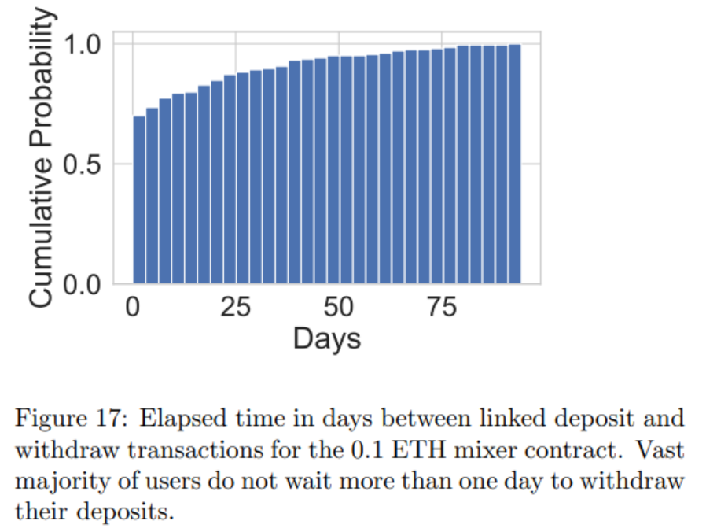
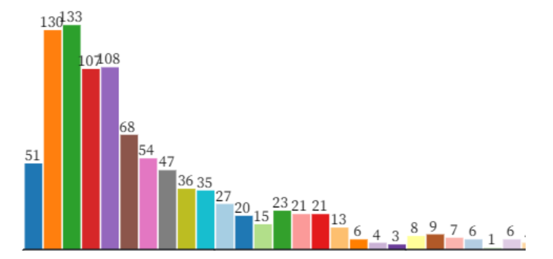

# Privacy Level Indicator

The indicator finds the best time for a depositor to withdraw their token for maximum privacy. Research by [Arxiv](https://arxiv.org/pdf/2005.14051.pdf) showed that a depositor's behavior can be anonymized if they acted like the vast majority.

To quote the paper: _In Figure 17, we observe that most users of the linked deposit-withdraw pairs leave their deposit for less than a day in the mixer contract. **This user behavior can be exploited for deanonymization by assuming that the vast majority of the deposits are always withdrawn after one or two days**._

For example, if most users withdraw within 48 hours, it makes it easier to link depositing addresses with withdrawal ones. A withdrawal happening today will likely be connected to one depositing 48 hours ago.

# Increasing Privacy

Users can increase their privacy level by:

1. Using mixing periods that are not used by the vast majority of users.
   This makes it harder for an attacker to use time as a deanonymizing tool
2. Using mixing periods that also have a large enough anonymity set.
   This ensures the user is still covered by a large enough anonymity set

## Privacy Algorithm

In order to find the ideal time for the user, the algorithm:

1. Collects times users have have spent recently in the mixer.
2. Creates [bins](https://observablehq.com/@d3/d3-bin) using the [Friedman-Diaconis' rule](https://en.wikipedia.org/wiki/Freedman%E2%80%93Diaconis_rule).

In simple terms, it creates bins for different times - e.g. 1-10 days, 11-20 days, 21-30 days.

3. Classify each user into the correct bin depending on their mixing time. For example, 51 users are in the 1-2 day bin (far left of the image above). Note this is sample data.
4. The algorithm then calculates a score based on the height of each bar.

-   The bar with the vast majority of users is given a low score (this is where an attacker would first look)
-   Bars with very few users are also given a low score

Users are encouraged to use any of the other bars that have a good score and are harder to deanonymize.

It is important not to specify the exact time for the user, as an attacker could use that information to reduce the anonymity set. It is better to give the user a range of suggestions they can use.
